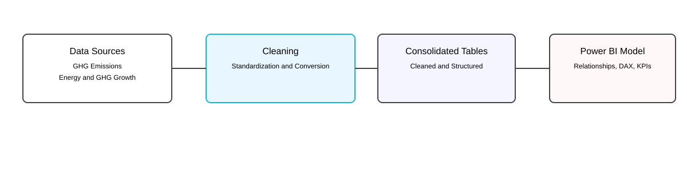
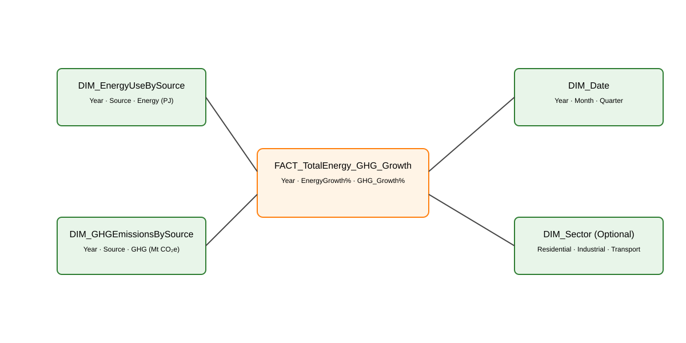

#  City of Calgary GHG & Energy Use Analysis (2000–2018)

A full **end‑to‑end** data analytics project analyzing **Calgary’s greenhouse gas (GHG) emissions** and **energy consumption** from **2000 to 2018**.  
This project demonstrates advanced skills in **data cleaning**, **data modeling**, **DAX**, **Power BI dashboarding**, and **technical storytelling**.

---

## 🔍 Project Overview

Canada’s commitment to the **Paris Agreement**, rising **carbon taxes**, and increasing **GHG emissions** make energy analytics more important than ever.  
This project transforms raw, inconsistent government datasets into a unified analytical model that reveals:

- Long‑term GHG emission trends  
- Energy consumption patterns by source  
- Sector‑level contributions  
- Calgary‑specific insights  
- Key performance indicators (KPIs) for policymakers  

The final deliverables include:

- Cleaned & Consolidated Datasets  
- A Power BI Semantic Model  
- DAX‑Powered KPIs & Metrics  
- Interactive Dashboards  
- A Professional Presentation Deck  

---
## 🎯 Business Problem

Climate change mitigation is no longer optional:

- **Carbon pricing policies** are permanent and scheduled to increase annually

- **GHG emissions continue to rise** despite regulatory frameworks

- Canada is legally bound to meet its **Paris Agreement commitments**

However, policymakers and analysts face three persistent challenges:

1️⃣ Disconnected and untidy emissions datasets

2️⃣ Limited visibility into **city-level emission drivers**

3️⃣ Lack of actionable KPIs to support evidence-based climate decisions

---
## 🧪 Methodology

## 🗂️ 1. Data Flow Diagram (DFD)

This diagram shows the full analytical **workflow** — from **four raw and semi-processed Excel datasets** sourced from federal and municipal emissions and energy reporting systems, to Power BI dashboards.

  

---

## ⭐ 2. Power BI Star Schema

The semantic model is built around **three core tables**:

- **Energy Use by Energy Source (PJ)**  
- **GHG Emissions by Energy Source**  
- **Total Energy & GHG Growth (2000–2018)**  

  

These datasets were originally provided as **flat, tabular files** with **inconsistent units**, **naming conventions**, and **temporal structures**, requiring significant preprocessing before analysis.

---

## 🧹 Data Cleaning & Standardization

All raw Excel files were cleaned and standardized using Excel and Power Query, Power Pivot and Transpose Function.

### ✔ Cleaning Steps
- Removed duplicates, blanks, and corrupted rows  
- Standardized column names and formats  
- Converted energy units for analytical consistency (kWh → GJ  → PJ)  
- Normalized sector and source categories  
- Aligned multi-year time series for trend analysis  
- Validated numerical ranges and totals after consolidation to ensure data integrity 

### ✔ Consolidated Tables Produced
- `Energy_Use_By_Source_Clean.xlsx`  
- `GHG_Emissions_By_Source_Clean.xlsx`  
- `Total_Energy_GHG_Growth.xlsx`  

These tables form the foundation of the Power BI model.

---

## 🧠 Data Modeling (Power BI)

The Power BI model includes:

### **✔ One‑to‑One Relationship**
- **Energy Use by Source ↔ GHG Emissions by Source**

### **✔ Many‑to‑Many Relationship**
- **Total Energy & GHG Growth ↔ Source/Sector tables**

### **✔ Additional Modeling**
- Custom **Date Table**  
- Hierarchies (Year → Source → Sector)  
- Referential integrity checks  
- Data categories & formatting  

---

## 📐 DAX Measures

A robust DAX layer powers all KPIs and dashboards.

### **Unit Conversions**
- GJ → PJ  
- GJ → kWh  
- Emission intensity per unit of energy  

### **KPI Measures**
- `Total GHG Emissions`
- `Total Energy Consumption`
- `YoY % Change`
- `Energy Growth %`
- `GHG Growth %`
- `Emission Intensity`
- `Sector Contribution %`

### **Analytical Measures**
- Rolling averages  
- Trend indicators  
- Normalized metrics  

---

## 📊 Dashboards & Visuals

The Power BI report includes:

### 1️⃣ Executive KPI Dashboard**
- Total GHG emissions  
- Total energy consumption  
- Growth since 2000  
- Emission intensity trends  

### 2️⃣ Energy Source Analysis**
- Electricity  
- Natural gas  
- Motor gasoline  
- Oil  
- Aviation fuels  
- Wood waste & pulping liquor  

### 3️⃣ Sectoral Emissions**
- Residential  
- Commercial & Institutional  
- Industrial  
- Transportation  
- Agriculture  

### 4️⃣ Calgary‑Focused Insights**
- Localized trends  
- Policy implications  
- Carbon tax impact  
- Paris Agreement alignment  

---

## 🎤 Final Presentation

A polished PowerPoint deck and a Full PDF report summarize:

- Project scope  
- Business problem  
- Data transformation  
- Key insights  
- Policy implications  
- Recommendations  

This presentation is designed for **executive and academic audiences**.
---
### 🎞️ Full Capstone Project Slides
👉 

---
### 📄 Full Capstone Project Report
👉 

---

## 🧰 Tools & Technologies

| Tool | Purpose |
|------|---------|
| **Excel** | Cleaning, Standardization, Consolidation |
| **Power BI** | Modeling, DAX, Dashboards |
| **DAX** | KPIs, Calculations, Time Intelligence |
| **GitHub** | Documentation & Version Control |

---

## 💡 Key Outcomes

- Built a **fully automated analytical model** for 18 years of Calgary energy & GHG data  
- Delivered **interactive dashboards** for decision‑makers  
- Standardized and consolidated multiple messy datasets  
- Applied **advanced DAX** for KPIs and time‑series analysis  
- Produced a professional **presentation** for academic evaluation  
- Demonstrated strong **data engineering + BI storytelling** skills  

---

## ⭐ Explore the Dashboard

The Power BI file is included: 👉 

---
You can download and open it in **Power BI Desktop**.

## 🚀 Strategic Value & Impact

This project demonstrates how analytics can support climate strategy by:

- Converting raw emissions data into **actionable intelligence**

- Enabling evidence-based policy discussions

- Supporting transparency and accountability in emissions reporting

- Providing a scalable framework for future climate analytics initiatives

---

## 🔮 Future Enhancements

- Integrate **forecasting models** to project future emissions

- Add **policy scenario analysis** (carbon tax impact, reduction targets)

- Include **per-capita and intensity-based metrics**

- Expand to other Canadian cities for cross-municipal benchmarking

---

## 👤 Author

**Waqas Hameed**  

Data Analyst | Business Intelligence |Data Storyteller | Visualization & Reporting | Power BI

---
⭐ If you found this project insightful, feel free to star the repository!

